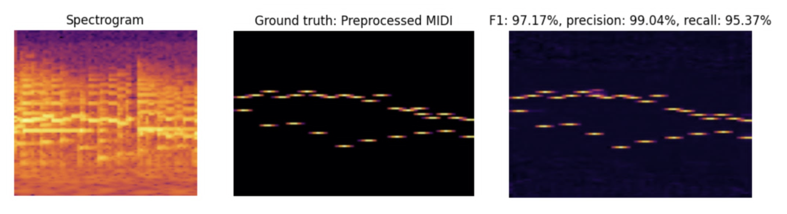

# `beetle-transcriber`

In this project I attempt to create an audio-to-MIDI ML model for music transcription, without any prior knowledge on this topic. Beetles are deaf.

## Status

### TODO:
- Add standard stuff: LR scheduler, dropout, augmentation, etc
- Refactor for more configurability (expose spectrogram config etc) and try some hyperparameters

### 22.5 (3)

Added harmonic lowering.

### 22.5 (2)

I made it 2d, let's see what happens.

> Update: It has significantly better scores. I hit >85% F1 score with the current time resolution.

### 22.5

It's doing something! This is the onset map, without any consideration for sub-time-bin offset estimation, MIDI note velocity or note duration (which is apparently a hard problem).

### 21.5

It's fitting, but not very well. With the current time resolution I get ~50% ish F1 score (which, for the record, is waay better than random
but still crap).

Ideas:
- Reduce the time resolution and allow for multi-note grid squares (somehow)
- Loosen the time precision constraints, e.g. allow predicting one square early or late if the offset is right
    - Would need some kind of hungarian matching?

> Somehow did both and neither at the same time by blurring each data point and allowing for overlap / "additive synthesis"
> This raises the question of how to rebalance the loss, since before we had "mean loss for notes" + "mean loss for blank spaces".
> In the end, I kept this idea and considered any grid square with nonzero signal to be a note.

## Data

We use the [Maestro V3](https://magenta.withgoogle.com/datasets/maestro) dataset.

## MIDI preprocessing

The MIDI is preprocessed into a "ML friendly" format as follows. First, a time resolution is chosen (e.g. 50 ms).
Then, the file is represented as a 3d float tensor with shape `(num time steps, num notes, channels)`. Each note 
is written to a given "slot" determined by time and pitch, and has 4 associated channels.

For example, at time resolution 50 ms, a C4 played from `T_start = 10.003` to `T_end = 10.5003` with velocity 57 would 
be written at index `[200, 60]` as `[1, 0.003, 0.5, 57]` (pre-normalization), because:

- `200` is the time step of the start of the note (50 ms * 200 = 10 s)
- `60` is the MIDI note ID for C4
- `1` represents the model confidence that a note has started at this time step. Most time/note locations contain a 0.
- `0.003` is the offset of the note start within the time step
- `0.5` is the duration in seconds
- `57` is the velocity.

These values are then normalized, check the code for details.

> Note: If notes are repeated too fast it results in a collision. In that case only the later note is written to this format.

## Audio preprocessing

Audio is preprocessed as a log-mel spectrogram.

- Update: turns out there's some kind of spectrogram with musically aligned frequency bins (obviously), 
which is called "Contant Q Transform". Switched to that and made results slightly worse. Maybe it's 
configured wrong?

- Maybe I should write my own (either post-STFT filter banks or even custom STFT to get log-spaced 
detected frequencies instead of linear).

## Model

A 1d UNet / MobileNet-ish custom job. Mel bins are treated as channels. The output is reshaped from `(..., time, D)`
into `(..., time, notes, channels)`.

